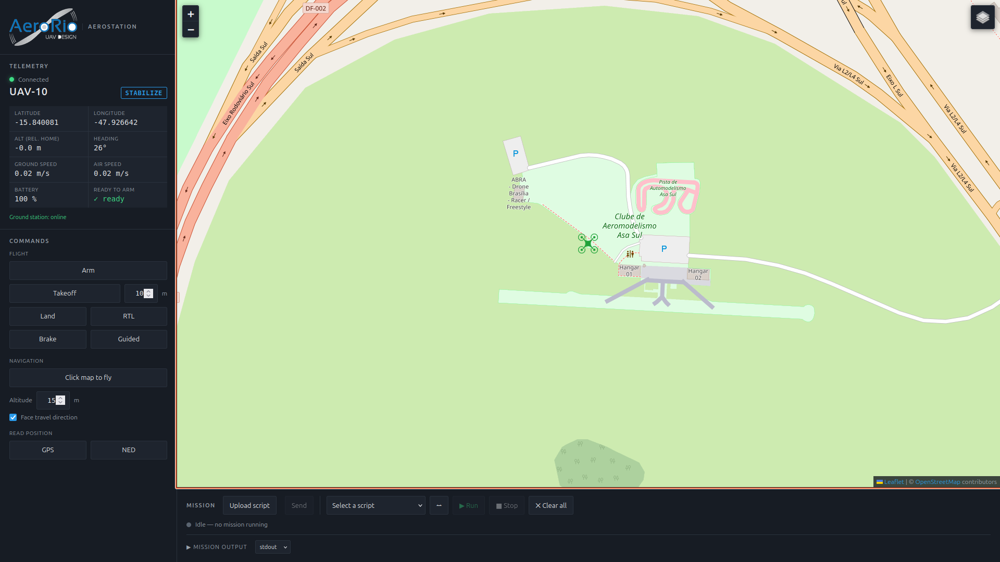
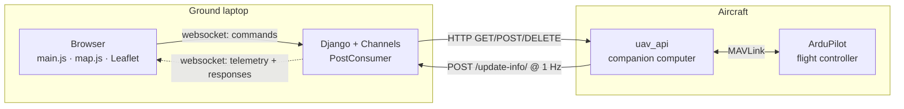
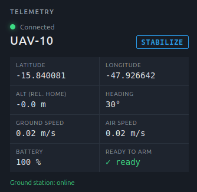
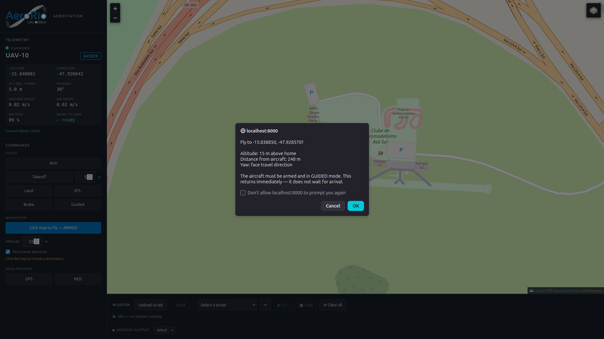
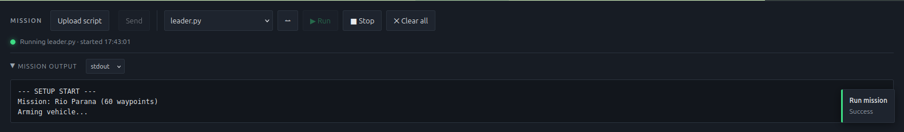
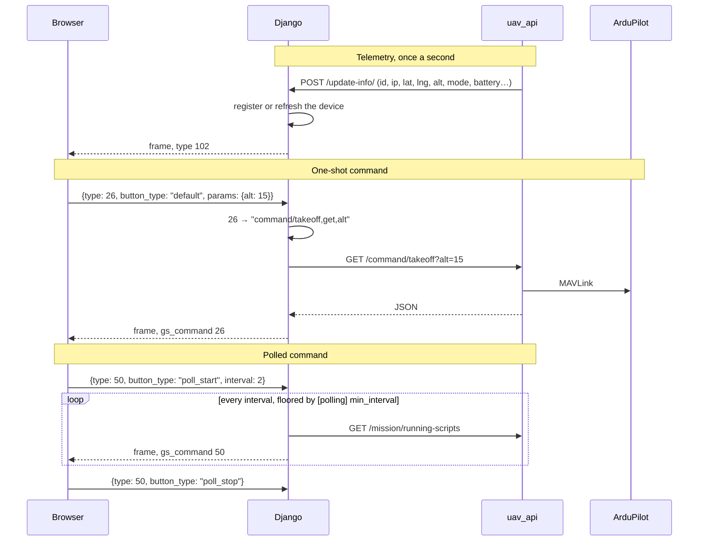

# AeroStation

Web ground station for a single UAV, built by **AeroRio** (PUC-Rio) for
competition field operations.

AeroStation runs on the laptop in the pit. It talks to
[`uav_api`](https://github.com/Project-GrADyS/uav_api), which runs on the
drone's companion computer and speaks MAVLink to ArduPilot. You need both.



---

## What it does

- Live telemetry and a flight track on the map.
- Arm, takeoff, land, RTL, brake, guided.
- Click the map to fly there.
- Upload Python mission scripts to the drone, run one, watch its output, stop it.
- A log file per session recording every frame received and every command sent.

## What it doesn't

It is a thin operator interface over `uav_api`, not a QGroundControl
replacement. There is no waypoint editor, no parameter editing, no firmware
tooling, and no multi-drone support — the upstream project had the last one and
this fork deliberately dropped it.

---

## How it fits together



Two things follow from this shape, and most confusion traces back to one of them.

**The browser never reaches the drone.** `uav_api` sends no CORS headers, so a
page served from the ground station cannot call it. Every command travels
browser → websocket → Django → HTTP → `uav_api`. Django is not decoration here;
it is the only thing that can make the call.

**The drone introduces itself.** `uav_api` POSTs its position to
`/update-info/` once a second, and that POST carries the address it can be
reached at. Until the first one arrives the ground station does not know the
drone exists, and commands go nowhere — see [Troubleshooting](#troubleshooting),
because this failure is silent.

---

## Install

Python 3.11 or newer, and git. No Node, no build step.

```console
git clone git@github.com:puc-aerorio/aerostation.git
cd aerostation
python3 -m venv .venv && source .venv/bin/activate
pip install -r requirements.txt
```

Create `config/.env` — **next to `settings.py`, not in the repository root**,
which is where `django-environ` looks:

```
SECRET_KEY='put-something-random-here'
```

The application will not start without it, and `.env` is gitignored, so every
fresh clone hits this once. There is no `GOOGLE_MAPS_API_KEY` any more; the map
is Leaflet and OpenStreetMap.

## Run

```console
python manage.py runserver 0.0.0.0:8000
```

Bind to `0.0.0.0`, not the default — the drone has to reach you across the field
network, and so does anyone else with a browser. Then open
`http://<laptop-ip>:8000/`.

> If `uav_api` runs on the same machine, give it a different port. Both default
> to 8000.

---

## Connect the drone

On the companion computer, point `uav_api` at the ground station:

```console
uav-api --port 8001 --sysid 10 --gradys_gs <laptop-ip>:8000
```

Within a second or two the telemetry panel fills in and the aircraft appears on
the map. If it doesn't, `connections/LOGS/` will tell you whether the POSTs are
arriving at all.

The status dot reads the link, not the aircraft:

| | Meaning |
|---|---|
| 🟢 active | Telemetry arriving normally |
| 🟡 on hold | Nothing heard recently |
| 🔴 inactive | Link considered lost; the numbers blank rather than going stale |

Two independent watchdogs feed it: the browser's, at 3 s and 8 s, and the
server's `[list-updater]` thresholds, at 25 s and 50 s. **The worse verdict
wins.** The browser's exists because noticing a lost link only after 25 seconds
is too slow to fly on.

---

## Using it



### Telemetry

Position, altitude, heading, ground and air speed, battery, ready-to-arm, and
the current flight mode.

A few readings mean something specific:

- **Alt** is metres above **HOME**, not above sea level.
- **Battery** shows `—` when the autopilot reports `-1`, which means "not
  estimated", not "empty".
- **Ready to arm** and **flight mode** can be genuinely unknown — before the
  first heartbeat there is no answer, and `—` is not the same as "no".
- **`no fix`** in place of coordinates means the GPS has no position yet.
  ArduPilot reports 0°/0° until the EKF has an origin, so AeroStation withholds
  the marker rather than drawing your aircraft in the Atlantic.

### Flight commands

Arm, takeoff (with an altitude, 1–500 m), land, RTL, brake, guided, and one-shot
GPS/NED readouts. Land, RTL and brake ask for confirmation first.

- **Brake** stops the aircraft hard and holds position. Movement commands stay
  dead until you press **Guided** — this catches people out.
- **Land** and **RTL** do not return until the aircraft is down and disarmed.
  That is why the timeout in `[http]` is measured in minutes.

### Click to fly



Press **Click map to fly** to arm the mode — a stray click must never command an
aircraft — then click a destination. The confirmation states the coordinates,
the altitude and **the distance from the aircraft**, which is the number that
catches a mis-click.

The aircraft must be armed and in GUIDED. The command returns as soon as the
target is accepted; it does not wait for arrival. If the vehicle refuses, the
target marker is removed rather than left implying something is on its way.

### Missions



A mission is a Python script that runs **on the drone**, in a tmux session,
flying it by calling `uav_api` locally. Upload a `.py`, pick it, run it. Expand
the drawer to tail its stdout or stderr.

AeroStation runs one at a time. `uav_api` itself permits several, so if
something was started outside AeroStation the panel says so rather than hiding it.

> **Stop kills the script, not the aircraft.** The drone holds whatever it was
> last told to do. Unless the script lands on interrupt, use **Land** or **RTL**
> to bring it down.

### Map

OpenStreetMap by default, Esri satellite in the layer switcher — usually the
more useful of the two over a flying field. The track draws as the aircraft
moves, and the view centres once on the first fix, after which it is yours.

Leaflet is vendored in this repository, so the interface loads with no internet.
**Map tiles are not** — they are fetched on demand. Before a competition, browse
the site at the zoom levels you need while you still have a connection, or point
the tile URLs in `map.js` at a local tile server.

---

## Troubleshooting

| Symptom | Cause | Fix |
|---|---|---|
| Stuck on "waiting for drone" | The drone's POSTs are not arriving | Check `--gradys_gs` points at the laptop, that the server is bound to `0.0.0.0`, and the firewall. `connections/LOGS/` shows `receive-info` lines if they land. |
| Buttons do nothing — no toast, no error | No drone registered yet, so there is nothing to send to. **This fails silently.** | Wait for telemetry. The drone must POST before it can be commanded. |
| `ImproperlyConfigured: SECRET_KEY` | No `config/.env` | See [Install](#install). It goes next to `settings.py`. |
| Map is an empty grid | No route to the tile servers | Expected offline. Pre-cache the site while connected. |
| Tiles show "Access blocked" | Tile servers reject requests with no `Referer` | Handled by `SECURE_REFERRER_POLICY` in `settings.py`; if you changed it, change it back. |
| A command silently does nothing | Missing trailing slash in `[commands-list]` | `uav_api` 307-redirects and the body is dropped. See [Commands](#commands). |
| Aircraft drawn in the Atlantic | Should not happen | The no-fix guard covers this; `hasValidFix` in `main.js` is where to look. |

---

# Development

## Layout

```
aerostation/
├── config/              Django project: settings, ASGI, URLs
├── connections/         The app
│   ├── consumers_wrapper/
│   │   ├── post_consumers.py               command dispatch + HTTP to uav_api
│   │   ├── update_periodically_consumer.py device list and activity status
│   │   └── serial_consumers.py             inherited ESP32 path, off by default
│   ├── views.py         index, and the /update-info/ telemetry endpoint
│   └── LOGS/            one log file per server start
├── static/connections/
│   ├── js/main.js       websockets, telemetry, commands, mission panel
│   ├── js/map.js        Leaflet map, markers, track
│   ├── css/
│   ├── images/          logo, favicon, the three drone status icons
│   └── vendor/leaflet/  vendored so the interface works offline
├── templates/index.html the whole interface
├── tests/               see tests/README.md
└── config.ini           runtime configuration
```

## Configuration

Everything runtime lives in `config.ini`.

| Section | Key | What it does |
|---|---|---|
| `[post]` | `path_receive_info` | Where the drone POSTs telemetry. Changing it changes the URL `uav_api --gradys_gs` must target. |
| `[list-updater]` | `seconds_to_device_be_inactive`, `seconds_to_device_be_on_hold`, `update_delay` | Server-side activity thresholds. The browser applies its own, tighter ones too. |
| `[commands-list]` | *(numbered)* | Command number → endpoint. See below. |
| `[polling]` | `min_interval`, `max_interval`, `default_interval` | Bounds for `poll_start`. `min_interval` is a hard floor applied server-side, so a front-end bug cannot produce an unthrottled request loop. |
| `[http]` | `request_timeout`, `connect_timeout` | Outbound timeouts. Generous, because `/command/rtl` blocks until the aircraft has landed. |
| `[serial]` | `port`, `baudrate`, `serial_available` | Inherited ESP32 serial path. Off by default, still wired — `ws/connection/` and `ws/receive/` exist for it. |
| `[fallback]` | `default_uav_address` | Used only if a device registers without reporting its own address. `uav_api` always sends one. |

`config/.env` holds `SECRET_KEY`, and is not in version control.

## Commands

Each button sends a number over the websocket. `config.ini` maps it to an
endpoint on the drone:

```ini
[commands-list]
20 = telemetry/gps,get
24 = command/arm,get
26 = command/takeoff,get,alt
48 = mission/clear-scripts,delete
60 = movement/go_to_gps/,post
```

The format is `<endpoint>,<method>[,<param>...]`. Method may be `get`, `post`
or `delete`. Anything after the method names a **query parameter the command
accepts** — the consumer drops any parameter not listed, so the interface cannot
append arbitrary query strings.

> **Trailing slashes are load-bearing.** The endpoint is used exactly as
> written. `uav_api` 307-redirects `POST /mission/execute-script` to
> `/mission/execute-script/`, and aiohttp drops the request body on a redirect —
> so a missing slash presents as a command that silently does nothing.

### Adding one

Add a button to `templates/index.html`:

```html
<button class="button" id="new-button" type="button">New command</button>
```

Add a line to `[commands-list]`:

```ini
40 = new_endpoint,get
```

And wire the click in `static/connections/js/main.js`:

```javascript
document.getElementById('new-button').onclick = function () {
  sendCommand(40);
};
```

`sendCommand` takes the parameters the command table declares:

```javascript
sendCommand(26, 'default', {}, {alt: 12});   // takeoff to 12 m
```

Besides `default`, `button_type` selects three other behaviours:

| `button_type` | Effect |
|---|---|
| `default` | One request, method from the command table |
| `upload` | Multipart upload; `data` carries `{filename, content (base64), type}` |
| `poll_start` | Starts a throttled recurring request, at `interval` seconds |
| `poll_stop` | Cancels the matching poll |

Polls are keyed by *(command, receiver, params)*, so one command can poll with
different parameters at once — that is how the mission panel tails stdout and
stderr concurrently. Every poll is cancelled when its websocket closes.

```javascript
sendCommand(50, 'poll_start', {}, {}, 2.0);   // running-scripts, every 2s
sendCommand(50, 'poll_stop',  {}, {});        // stop it
```

> Earlier versions used a `checkbox` button type backed by a `keep_sending`
> loop with no sleep between requests. It was replaced because the endpoints it
> was pointed at — `/command/land`, `/command/rtl` — return only once the
> aircraft has landed and disarmed, so re-issuing them in a tight loop saturated
> both the drone and the event loop.

## Message flow



Frames the interface distinguishes:

- **`gs_command`** — stamped by Django on every command response, naming the
  command that produced it. `uav_api`'s own numeric `type` codes are deprecated
  upstream, so the interface dispatches on this instead.
- **`102`** — telemetry pushed by the drone.
- **`101` / `103`** — Django's own acknowledgements of that POST.
- **`900`** — a ground-station error: the request to the drone failed. Without
  it, failures would vanish as unretrieved async exceptions.

## Logs

Every server start opens `connections/LOGS/post-<timestamp>.log`, recording
every telemetry frame received and every command sent. **This is the flight
record** — after an incident it is the only account of what the ground station
saw and did.

```
2026-09-06 20:21:31,509; uav-10; receive-info; {'id': 10, 'type': 102, 'seq': 3, 'lat': -15.84, ...}
2026-09-06 20:21:32,044; gs; send-get; GET http://192.168.1.42:8001/command/arm {}
```

The format is `timestamp; source; origin; payload`, where `origin` is one of
`receive-info`, `send-get`, `send-post`, `send-*-response` or `upload-post`.

## Tests

See [`tests/README.md`](tests/README.md). Note the warning about running them on
a port your browser is not using.

---

## Heritage

AeroStation is a fork of
[`Project-GrADyS/gradys-gs-ng`](https://github.com/Project-GrADyS/gradys-gs-ng),
a ground station framework for multi-device field experiments. The Django and
Channels architecture, the consumer structure and the logging are theirs.

What changed: a single aircraft instead of a device network, Leaflet and
OpenStreetMap instead of Google Maps, `uav_api` as the counterpart on the drone,
a mission runner, click-to-fly, and Django 3.1 → 5.2 with Channels 3 → 4. The
bundled ArduPilot simulator was retired in favour of `uav_api` against SITL.

Map data © [OpenStreetMap](https://www.openstreetmap.org/copyright)
contributors; satellite imagery © Esri. Leaflet is vendored under
`static/connections/vendor/leaflet` (BSD-2-Clause).
